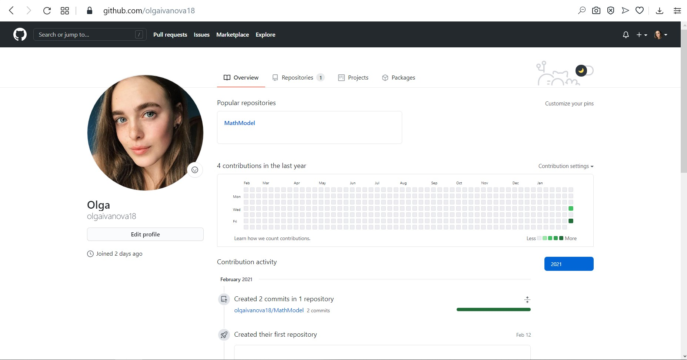
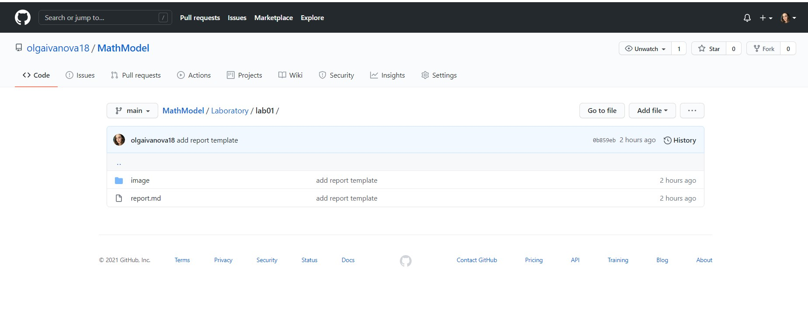
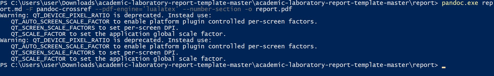
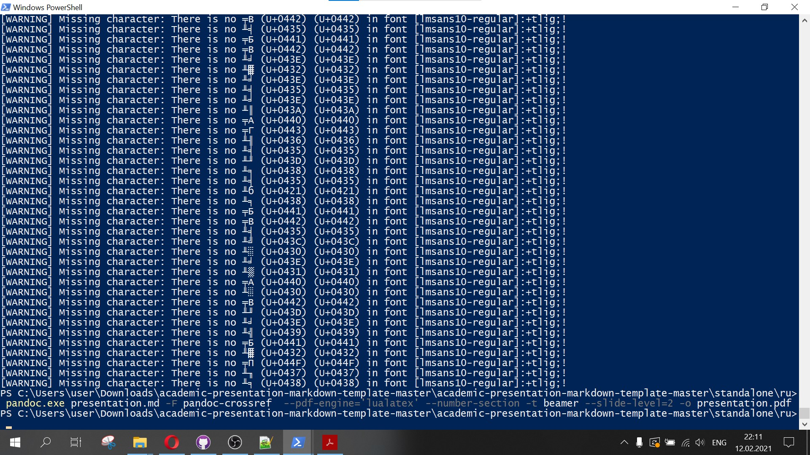
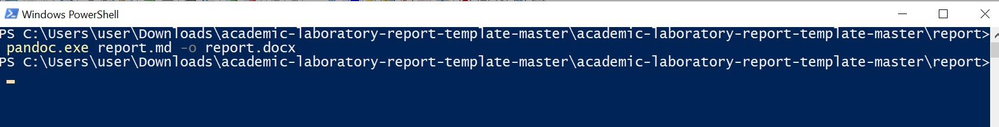

---
# Front matter
lang: ru-RU
title: "Отчёт по лабораторной работе №1"
subtitle: "Создание репозитрия"
author: "Иванова Ольга Игоревна НФИбд-01-18"

# Formatting
toc-title: "Содержание"
toc: true # Table of contents
toc_depth: 2
lof: true # List of figures
lot: true # List of tables
fontsize: 12pt
linestretch: 1.5
papersize: a4paper
documentclass: scrreprt
polyglossia-lang: russian
polyglossia-otherlangs: english
mainfont: PT Serif
romanfont: PT Serif
sansfont: PT Sans
monofont: PT Mono
mainfontoptions: Ligatures=TeX
romanfontoptions: Ligatures=TeX
sansfontoptions: Ligatures=TeX,Scale=MatchLowercase
monofontoptions: Scale=MatchLowercase
indent: true
pdf-engine: lualatex
header-includes:
  - \linepenalty=10 # the penalty added to the badness of each line within a paragraph (no associated penalty node) Increasing the value makes tex try to have fewer lines in the paragraph.
  - \interlinepenalty=0 # value of the penalty (node) added after each line of a paragraph.
  - \hyphenpenalty=50 # the penalty for line breaking at an automatically inserted hyphen
  - \exhyphenpenalty=50 # the penalty for line breaking at an explicit hyphen
  - \binoppenalty=700 # the penalty for breaking a line at a binary operator
  - \relpenalty=500 # the penalty for breaking a line at a relation
  - \clubpenalty=150 # extra penalty for breaking after first line of a paragraph
  - \widowpenalty=150 # extra penalty for breaking before last line of a paragraph
  - \displaywidowpenalty=50 # extra penalty for breaking before last line before a display math
  - \brokenpenalty=100 # extra penalty for page breaking after a hyphenated line
  - \predisplaypenalty=10000 # penalty for breaking before a display
  - \postdisplaypenalty=0 # penalty for breaking after a display
  - \floatingpenalty = 20000 # penalty for splitting an insertion (can only be split footnote in standard LaTeX)
  - \raggedbottom # or \flushbottom
  - \usepackage{float} # keep figures where there are in the text
  - \floatplacement{figure}{H} # keep figures where there are in the text
---

# Цель работы

Познакомиться с программой GITHUB, создать репозитой для лабораторных работ.

# Задание

Необходимо зарегистрироваться в GitHub, создать локальный репозиторий, загрузить его на Git, подготовить отчёт.

# Выполнение лабораторной работы

Я уже была зарегистрирована на GitHub, соответственно процесс регистрации мне повторять не нужно. (рис. -@fig:001)
{ #fig:001 width=70% }

Далее я создаала репозиторий для хранения лабораторной работы и загрузила его на GitHub. (рис. -@fig:002)
{ #fig:002 width=70% }

С помощью команд pandoc.exe presentation.md -F pandoc-crossref  --pdf-engine='lualatex' --number-section -t beamer --slide-level=2 -o presentation.pdf и pandoc.exe report.md -F pandoc-crossref --pdf-engine='lualatex' --number-section -o report.pdf 
и pandoc.exe report.md -o roport.docx я конвертировала файлы md в docx и pdf. (рис. -@fig:003 , -@fig:004 , -@fig:005)

{ #fig:003 width=70% }
{ #fig:004 width=70% }
{ #fig:005 width=70% }

По окончании работы загрузила мои отчеты в GitHub.

# Выводы

В ходе выполнения этой лабораторной работы я узнала, каким способом создавать директории в GitHub, выгружать туда свои файлы, а так же научилась работать с файлами формата .md .
