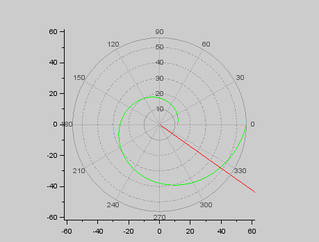

---
# Front matter
lang: ru-RU
title: "Отчет по лабораторной работе №2"
subtitle: "Задача о погоне - вариант 44"
author: "Иванова Ольга Игоревна НФИбд-01-18"

# Formatting
toc-title: "Содержание"
toc: true # Table of contents
toc_depth: 2
lof: true # List of figures
fontsize: 12pt
linestretch: 1.5
papersize: a4paper
documentclass: scrreprt
polyglossia-lang: russian
polyglossia-otherlangs: english
mainfont: PT Serif
romanfont: PT Serif
sansfont: PT Sans
monofont: PT Mono
mainfontoptions: Ligatures=TeX
romanfontoptions: Ligatures=TeX
sansfontoptions: Ligatures=TeX,Scale=MatchLowercase
monofontoptions: Scale=MatchLowercase
indent: true
pdf-engine: lualatex
header-includes:
  - \linepenalty=10 # the penalty added to the badness of each line within a paragraph (no associated penalty node) Increasing the υalue makes tex try to haυe fewer lines in the paragraph.
  - \interlinepenalty=0 # υalue of the penalty (node) added after each line of a paragraph.
  - \hyphenpenalty=50 # the penalty for line breaking at an automatically inserted hyphen
  - \exhyphenpenalty=50 # the penalty for line breaking at an explicit hyphen
  - \binoppenalty=700 # the penalty for breaking a line at a binary operator
  - \relpenalty=500 # the penalty for breaking a line at a relation
  - \clubpenalty=150 # extra penalty for breaking after first line of a paragraph
  - \widowpenalty=150 # extra penalty for breaking before last line of a paragraph
  - \displaywidowpenalty=50 # extra penalty for breaking before last line before a display math
  - \brokenpenalty=100 # extra penalty for page breaking after a hyphenated line
  - \predisplaypenalty=10000 # penalty for breaking before a display
  - \postdisplaypenalty=0 # penalty for breaking after a display
  - \floatingpenalty = 20000 # penalty for splitting an insertion (can only be split footnote in standard LaTeX)
  - \raggedbottom # or \flushbottom
  - \usepackage{float} # keep figures where there are in the text
  - \floatplacement{figure}{H} # keep figures where there are in the text
---

# Цель работы

Привести пример построения математических моделей для выбора правильной стратегии при решении задач поиска. 
Например, рассмотрим задачу преследования браконьеров береговой охраной. На море в тумане катер береговой охраны преследует лодку браконьеров. Через определенный промежуток времени туман рассеивается, и лодка обнаруживается на расстоянии k км от катера. Затем лодка снова скрывается в тумане и уходит прямолинейно в неизвестном направлении. Известно, что скорость катера в n раза больше скорости браконьерской лодки. 
Необходимо определить по какой траектории необходимо двигаться катеру, чтоб нагнать лодку.


# Задание

1. Провести необходимые рассуждения и вывод дифференциальных уравнений, если скорость катера больше скорости лодки в n раз.
2. Построить траекторию движения катера и лодки для двух случаев. 
3. Найти точку пересечения траектории катера и лодки.


# Выполнение лабораторной работы

Принимаем за $t_0=0, X_0=0$  - место нахождения лодки браконьеров в момент обнаружения, $X_0=k$   - место нахождения катера береговой охраны относительно лодки браконьеров в момент обнаружения лодки.

Введем полярные координаты. Считаем, что полюс - это точка обнаружения лодки браконьеров $x_0=0 (\theta=x_0=0)$, а полярная ось r проходит через точку нахождения катера береговой охраны.

Чтобы найти расстояние $x$ (расстояние после которого катер начнет двигаться вокруг полюса), необходимо составить простое уравнение. Пусть через время $t$ катер и лодка окажутся на одном расстоянии $x$ от полюса. За это время лодка пройдет $x$, а катер $x-k$ (или $x+k$, в зависимости от начального положения катера относительно полюса). Время, за которое они пройдут это расстояние, вычисляется как $\frac{x}{υ}$ или $\frac{x+k}{υ}$ (для второго случая $\frac{x-k}{υ}$).  Так как время одно и то же, то эти величины одинаковы. Тогда неизвестное расстояние можно найти из следующего уравнения:  $\frac{x}{υ} = \frac{x+k}{υ}$ - в первом случае, $\frac{x}{υ} =  \frac{x-k}{υ}$ во втором случае.

Отсюда мы найдем два значения $x_1$ и $x_2$, задачу будем решать для двух случаев. 

$x_1=\frac{k}{n+1}$ ,при $\theta=0$

$x_2=\frac{k}{n-1}$ ,при $\theta=-\pi$

После того, как катер береговой охраны окажется на одном расстоянии от полюса, что и лодка, он должен сменить прямолинейную траекторию и начать двигаться вокруг полюса удаляясь от него со скоростью лодки $υ$. Для этого скорость катера раскладываем на две составляющие: $υ_r$ - радиальная скорость и $υ_t$- тангенциальная скорость. Радиальная скорость - это скорость, с которой катер удаляется от полюса $υ_r=\frac{dr}{dt}$. Нам нужно, чтобы эта скорость была равна скорости лодки, поэтому полагаем $υ=\frac{dr}{dt}$.
Тангенциальная скорость – это линейная скорость вращения катера относительно полюса. Она равна произведению угловой скорости $\frac{d\theta}{dt}$  на радиус $r$, $υr=r\frac{d\theta}{dt}$
Найдем тангенциальную скорость для нашей задачи $υ_t=r\frac{d\theta}{dt}$.
Вектора образуют прямоугольный треугольник, откуда по теореме Пифагора можно найти тангенциальную скорость $υ_t= \sqrt{n^2 υ_r^2-v^2}$. Поскольку, радиальная скорость равна $υ$, то тангенциальную скорость находим из уравнения $υ_t= \sqrt{n^2 υ^2-υ^2 }$. Следовательно, $υ_τ=υ\sqrt{n^2-1}$.

Тогда получаем $r\frac{d\theta}{dt}=υ\sqrt{n^2-1}$

Решение исходной задачи сводится к решению системы из двух дифференциальных уравнений 

$$
 \begin{cases}
   \frac{dr}{dt}=υ
	\\   
	r\frac{d\theta}{dt}=υ\sqrt{n^2-1}
 \end{cases}
$$

с начальными условиями

$$
 \begin{cases}
   \theta_0=0
   \\
	r_0=\frac{k}{n+1}
 \end{cases}
\
$$

$$
 \begin{cases}
   \theta_0=-\pi
   \\
	r_0=\frac{k}{n-1}
 \end{cases}
\
$$

Исключая из полученной системы производную по t, можно перейти к следующему уравнению: $\frac{dr}{d\theta}=\frac{r}{\sqrt{n^2-1}}$

Начальные условия остаются прежними. Решив это уравнение, мы получим
траекторию движения катера в полярных координатах. 
Теперь, когда нам известно все, что нам нужно, построим траекторию движения катера и лодки для двух случаев. 

---

```

n=4.1;
// разница в скорости между катером и лодкой
k=16.3; 
// начальное расстояние между катером и лодкой
fi=3*%pi/4;
//функция, описывающая движение катера береговой охраны
function dr=f(tetha, r)
dr=r/sqrt(n*n-1);
endfunction;
//начальные условия в первом случае
r0=k/(n+1);
tetha0=0;
tetha=0:0.01:2*%pi;
r=ode(r0,tetha0,tetha,f);
//функция, описывающая движение лодки браконьеров
function xt=f2(t) 
    xt=cos(fi)*t;
endfunction
t=0:1:800;
plot2d(t,f2(t),style = color('red'));
//построение траектории движения браконьерской лодки
polarplot(tetha,r,style = color('green')); 
//построение траектории движения катера в полярных координатах


r0=k/(n-1);
tetha0=-%pi;
figure();
r=ode(r0,tetha0,tetha,f);
plot2d(t,f2(t),style = color('red'));
//построение траектории движения браконьерской лодки
polarplot(tetha,r,style = color('green'));
//построение траектории движения катера в полярных координатах

```

---

## Условие задачи

На море в тумане катер береговой охраны преследует лодку браконьеров.
Через определенный промежуток времени туман рассеивается, и лодка обнаруживается на расстоянии 16,3 км от катера. 
Затем лодка снова скрывается в тумане и уходит прямолинейно в неизвестном направлении. 
Известно, что скорость катера в 4.1 раза больше скорости браконьерской лодки

## Решение

{ #fig:001 width=70% height=70% }

Точка пересечения красного и зеленого графиков - точка пересечения катера и лодки, исходя из графика, имеет параметры
$$
 \begin{cases}
   \theta=325 
   \\
	r=13
 \end{cases}
\
$$

{ #fig:002 width=70% height=70% }

Точка пересечения красного и зеленого графиков - точка пересечения катера и лодки, исходя из графика, имеет параметры
$$
 \begin{cases}
   \theta=325
   \\
	r=55
 \end{cases}
\
$$

Наблюдаем, что при погоне «по часовой стрелке» для достижения цели потребуется пройти значительно меньшее расстояние.

# Выводы

Рассмотрели задачу о погоне. Провели анализ и вывод дифференциальных уравнений. Смоделировали ситуацию.
